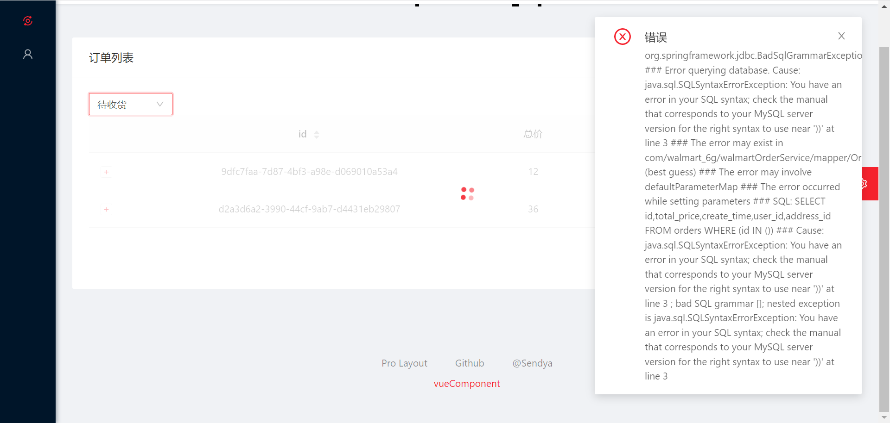
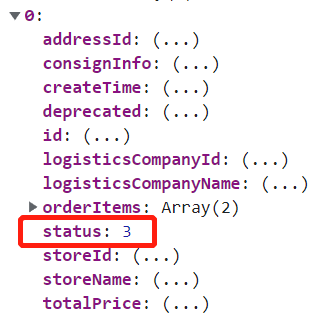

* 商家查询“待收货”状态的订单时报错：

* ~~商家修改子订单状态接口返回404~~

* ~~父订单状态与子订单的状态不一致(**父订单不应该有状态**)；
同时，商家不应该有父订单这一概念。 如图，父订单状态为3，子订单状态却为2:~~

* 购物车结算返回500，排查后发现在购物车中创建订单后返回的父订单id，和去订单列表里看的父订单id不一致？？？

* 前端订单创建时间显示不正常

* 卖家